
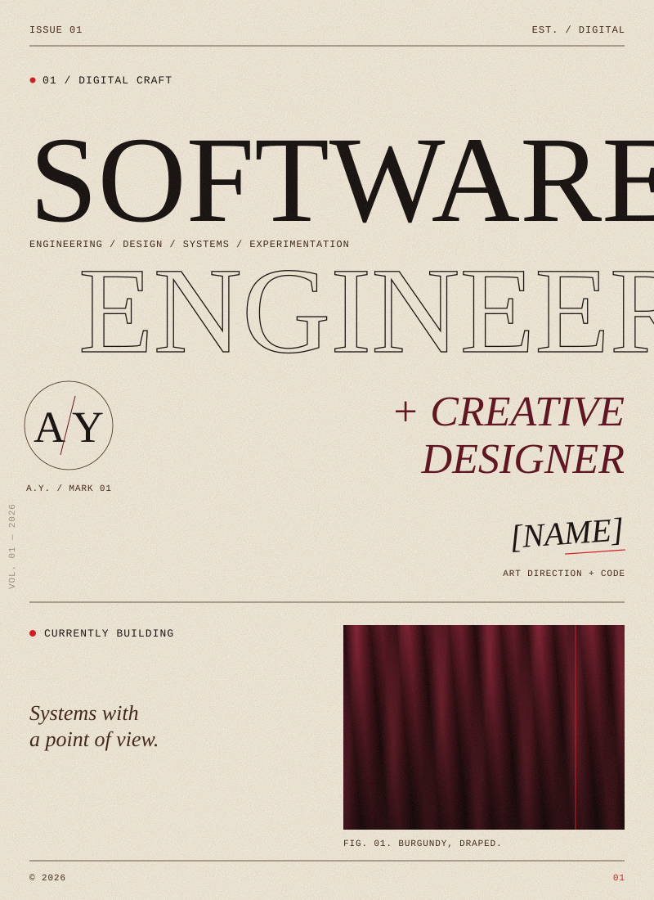

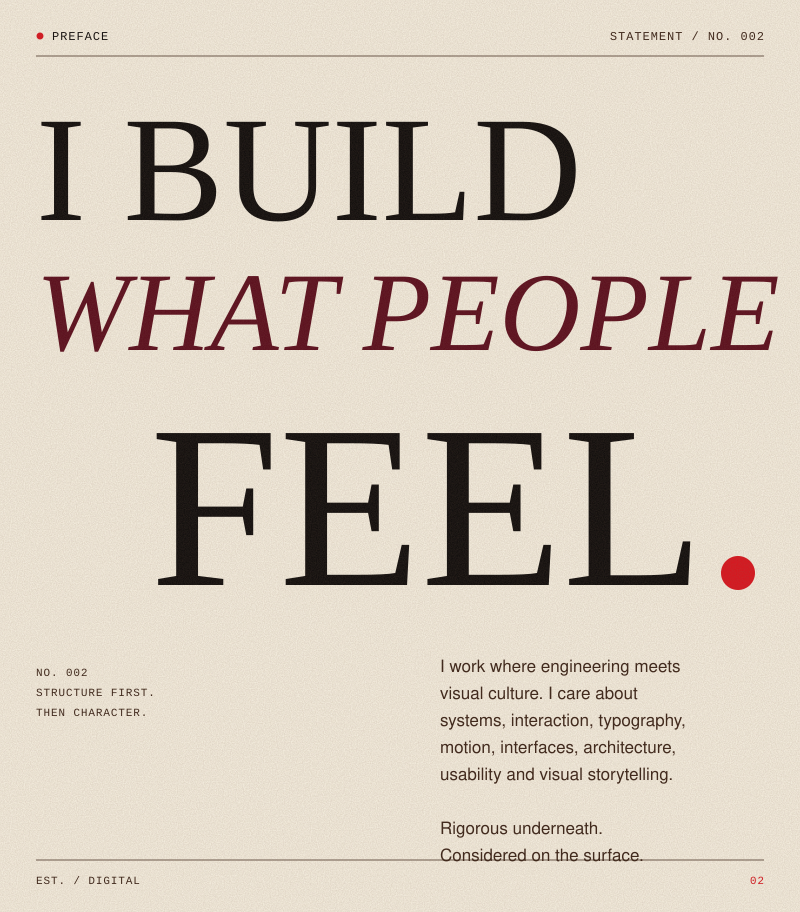

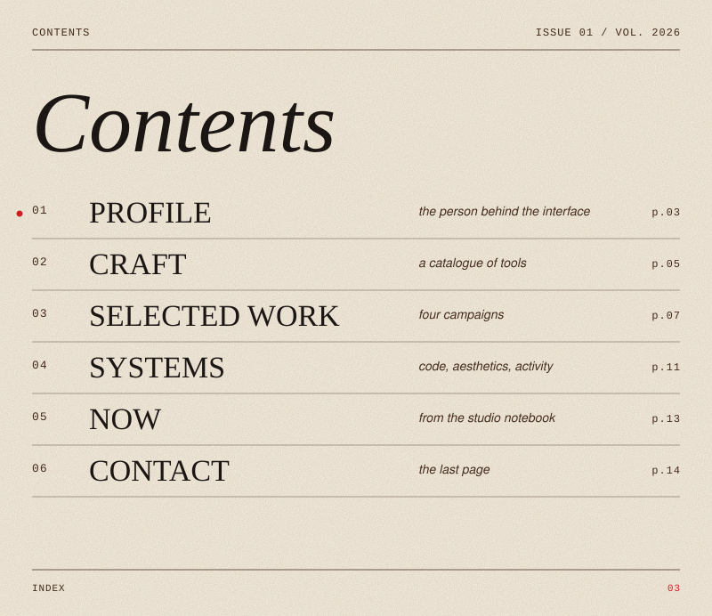

<a href="#profile">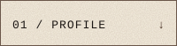</a><a href="#craft">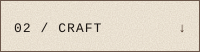</a><a href="#work">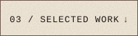</a><a href="#systems">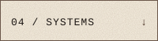</a><a href="#now">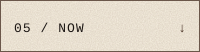</a><a href="#contact">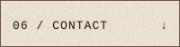</a>

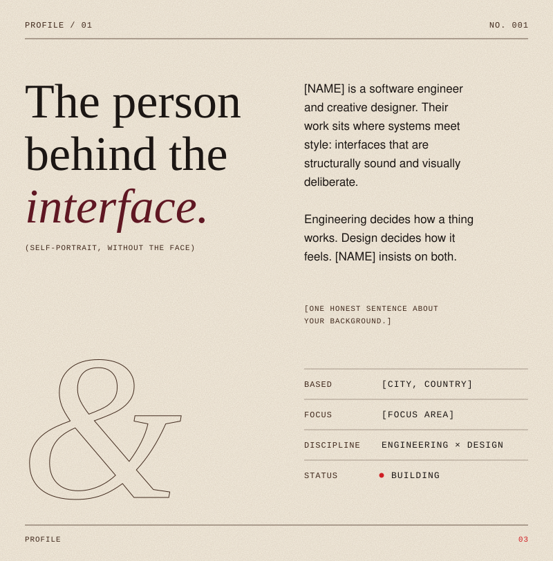

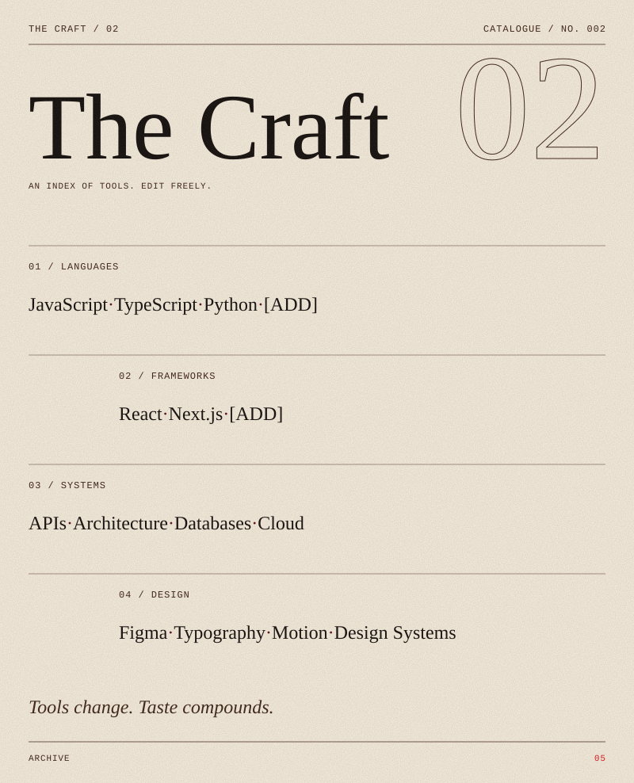

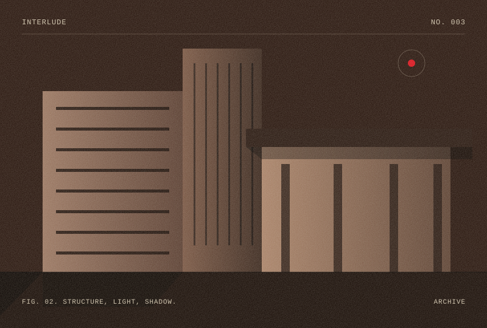

<a href="https://github.com/[USERNAME]/[PROJECT-LINK-001]">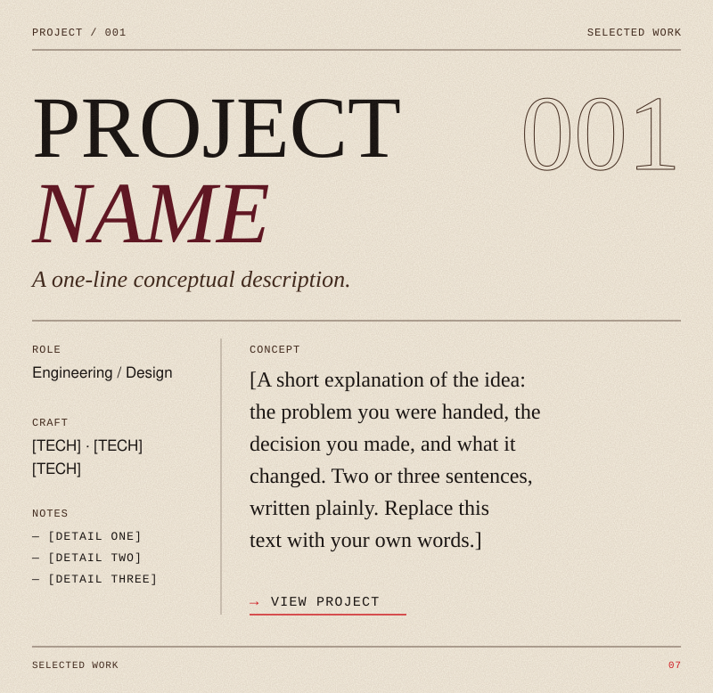</a>

<a href="https://github.com/[USERNAME]/[PROJECT-LINK-002]">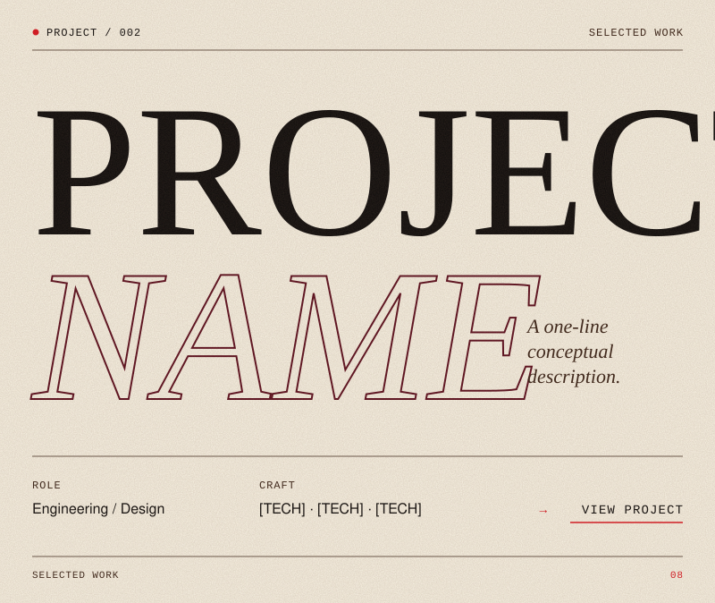</a>

<a href="https://github.com/[USERNAME]/[PROJECT-LINK-FEATURED]">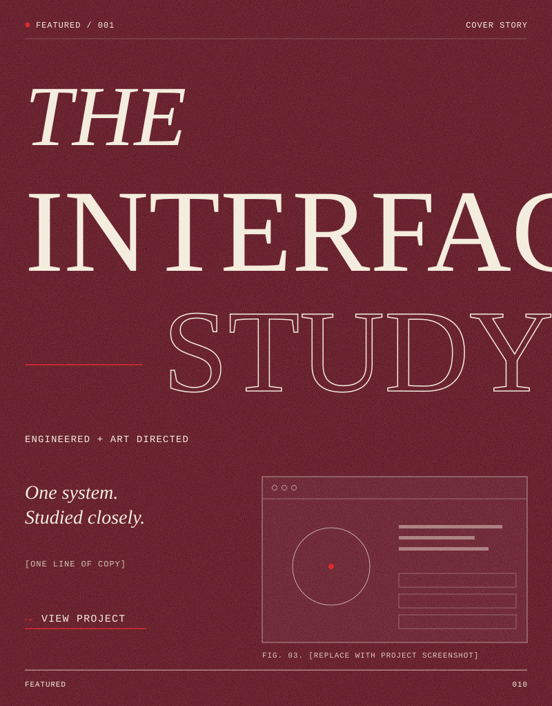</a>

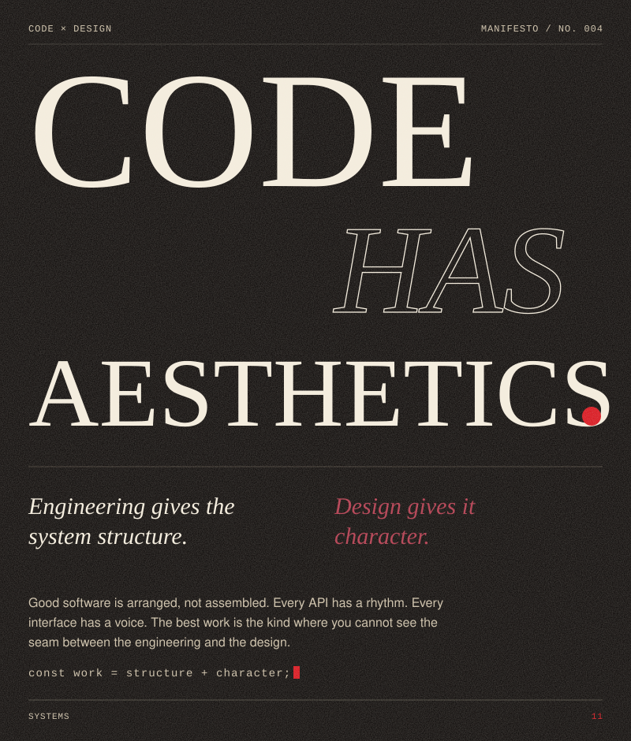

<a href="https://github.com/[USERNAME]/[PROJECT-LINK-003]">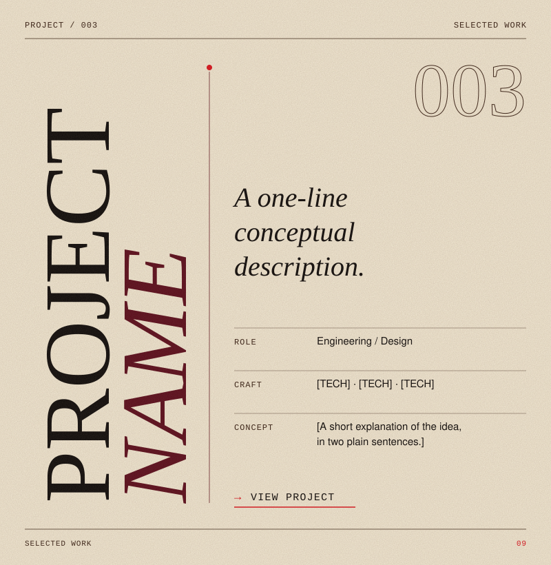</a>

<a href="https://github.com/[USERNAME]/[PROJECT-LINK-004]">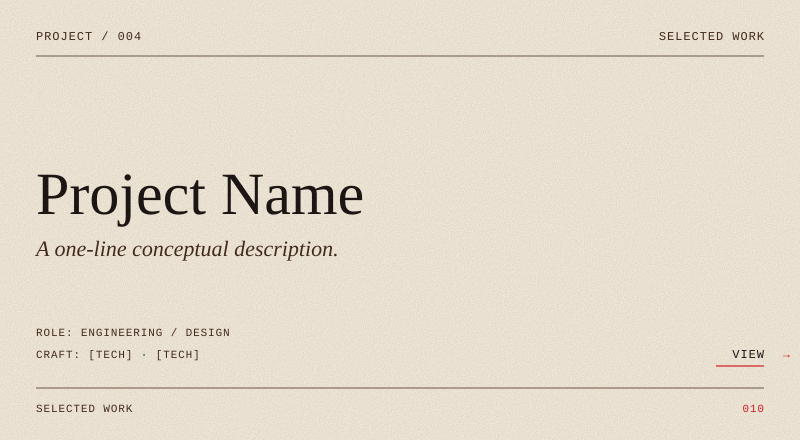</a>

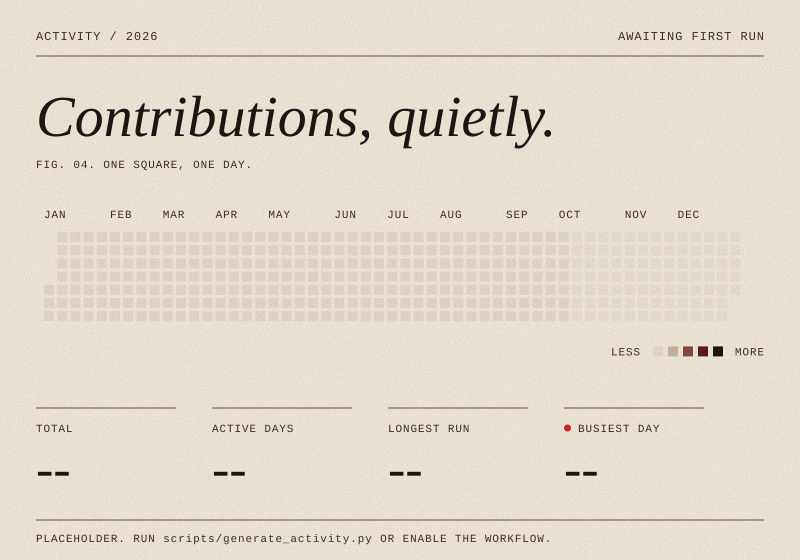

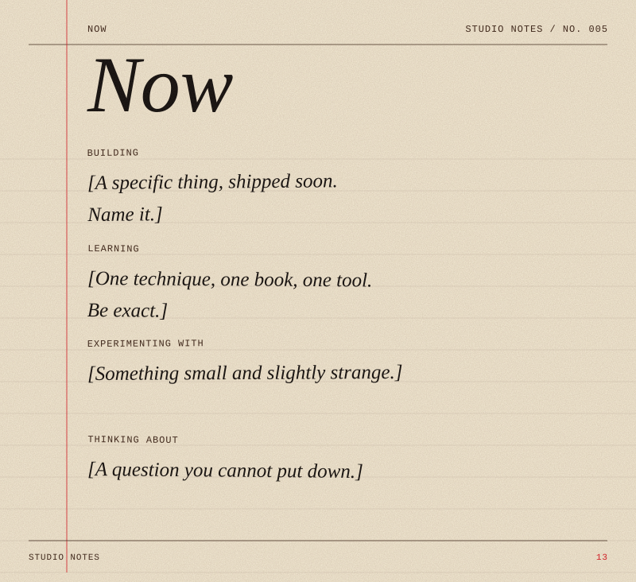

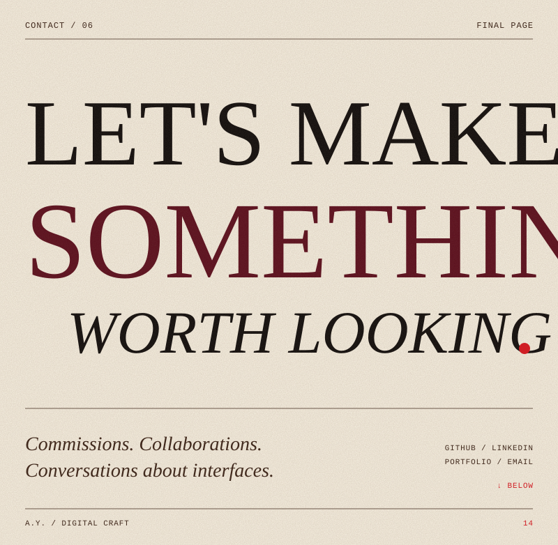

PLAIN TEXT VERSION

**Software engineer + creative designer.** Issue 01, Vol. 01, 2026. Currently building.

**I build what people feel.** I work where engineering meets visual culture: systems, interaction, typography, motion, interfaces, architecture, usability and visual storytelling. Rigorous underneath. Considered on the surface.

**Profile.** [NAME] is a software engineer and creative designer. Based in [CITY, COUNTRY]. Focus: [FOCUS AREA]. Discipline: engineering x design.

**The craft.** Languages: JavaScript, TypeScript, Python. Frameworks: React, Next.js. Systems: APIs, architecture, databases, cloud. Design: Figma, typography, motion, design systems.

**Selected work.** Four projects, plus a featured piece (The Interface Study). See the linked images above.

**Code has aesthetics.** Engineering gives the system structure. Design gives it character.

**Now.** Building: [..]. Learning: [..]. Experimenting with: [..]. Thinking about: [..].

**Contact.** GitHub, LinkedIn, portfolio, email. A.Y. / Digital Craft. 2026.

