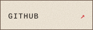
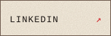
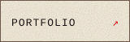
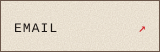
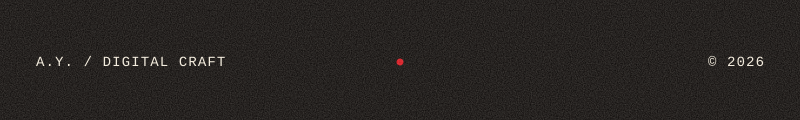

<p align="center">
  
</p>


<div align="center">

<sub>ISSUE 01  ·  STUDIO ARCHIVE  ·  2026</sub>

<br><br>

# AYESHA NAYAAB NADEEM

### Software engineer &  Creative director

</div>


<div align="right">

<sub>NO. 001  ·  ABOUT ME  ·  ANN </sub>

</div>

<div>

<br>

I build software with the same instinct I bring to design: **notice the detail.** I'm a software engineer and creative designer interested in the space where systems become experiences. I like taking complicated things apart, finding the essential structure, then rebuilding them into something that feels obvious, useful and quietly beautiful. I care about architecture. I care about typography. I care about interaction. And, occasionally, I care far too much about a 2px alignment.

<div align="left">

`ENGINEER`  `DESIGNER`  `MAKER`

</div>
</div>


<pre>
             ·············
         ··························
     ··························· ············                                                                                                                       ········
 ······ ····························· ··                                                                                                                      · · ··········
···············································                                                                                                         ··· ·· ·· ··········
········           ·····························                                                                                                 ············· ·· ··········
··                  ································                                                                               ························ · ··· · ··········
··                   ···············     ···············                                                                 ·····················    ··   ···· ·· ·· ··········
·                     ··············                   ·····                                           ··································  ···        ··· · ·· ·· ··········
                    ·· ··············                     ····                                   ····································      ·       ·  ··· ···· ·· ··········
                ·      ····  · ········    ·                 ···                             ·······  ·············     ············                         ··          ···
              ·         ···     ········                                                   ···               ··· ··   ·············
            ·             ··················                                                  ···         ·  ·       ······   ··
          ·                    ··············                    ·· ·                                              ······
        ·                           ······· ·                     ···                                         ·······                       ··                       · ·····
      ·                               ·····     ·                                                           ·····       ··                ··                               ·
   ·                                          ··  ·                                                       ······         ····  ···     ···
·                                               ··                                                      ··        ··                ····
                                                                                                         ·····   ·    ·       ·······
                                                                                                           ··    ·   ·       ·
                                                                                                           ·    ·   ·       ·
                                                                                                           ···  ·   ·   ··  ·
                                                                                                           ···  ·· ··   ·· ·
                                                                                                            ·  · ····   ···
</pre>

<h1 align="center">
  <a href="https://git.io/typing-svg">
    
  </a>
</h1>

<pre>
    __________
 / ___  ___ \
/ / @ \/ @ \ \
\ \___/\___/ /\
 \____\/____/||
 /     /\\\\\//
 |     |\\\\\\
  \      \\\\\\
   \______/\\\\
    _||_||_
     -- --

</pre>


<br>

# CONTENTS
`ENGINEERING`    `DESIGN`    `CREATIVE TECHNOLOGY`
<table>
<tr>
<td width="16%"><sub>01</sub></td>
<td><b>PROFILE</b></td>
<td width="45%"><sub>A HUMAN APPROACH TO DIGITAL CRAFT</sub></td>
</tr>
<tr>
<td><sub>02</sub></td>
<td><b>CRAFT</b></td>
<td><sub>THE ENGINEERING COLLECTION</sub></td>
</tr>
<tr>
<td><sub>03</sub></td>
<td><b>SELECTED WORK</b></td>
<td><sub>OBJECTS / SYSTEMS / EXPERIMENTS</sub></td>
</tr>
<tr>
<td><sub>04</sub></td>
<td><b>DESIGN</b></td>
<td><sub>WHERE CODE MEETS FORM</sub></td>
</tr>
<tr>
<td><sub>05</sub></td>
<td><b>NOW</b></td>
<td><sub>STUDIO NOTES / 2026</sub></td>
</tr>
<tr>
<td><sub>06</sub></td>
<td><b>CONTACT</b></td>
<td><sub>THE BACK PAGE</sub></td>
</tr>
</table>

<br><br>

---

# 01 / PROFILE

<br>

<div align="right">

# 𝓪 𝓵𝓲𝓽𝓽𝓵𝓮<br>

# 𝓪𝓫𝓸𝓾𝓽 𝓶𝓮

</div>

<br>

I build software with the same instinct I bring to design:

**notice the detail.**

I'm a software engineer and creative designer interested in the space where
systems become experiences.

I like taking complicated things apart, finding the essential structure,
then rebuilding them into something that feels obvious, useful and quietly beautiful.

I care about architecture.

I care about typography.

I care about interaction.

And, occasionally, I care far too much about a 2px alignment.

<br>

<div align="center">

`ENGINEER`    ×    `DESIGNER`    ×    `MAKER`

<br>

### 𝓼𝓸𝓯𝓽𝔀𝓪𝓻𝓮  𝓲𝓼  𝓪  𝓬𝓻𝓪𝓯𝓽

</div>

<br><br>

---

# 02 / CRAFT

<div align="right">
<sub>COLLECTION / 01</sub>
</div>

<br>

# THE

# CRAFT

<br>

<table>
<tr>
<td width="24%" valign="top">

<sub>01 — LANGUAGES</sub>

</td>
<td>

`TypeScript` · `JavaScript` · `Python` · `SQL`

</td>
</tr>

<tr>
<td valign="top">

<sub>02 — FRAMEWORKS</sub>

</td>
<td>

`React` · `Next.js` · `Node.js` · `YOUR_FRAMEWORK`

</td>
</tr>

<tr>
<td valign="top">

<sub>03 — SYSTEMS</sub>

</td>
<td>

`APIs` · `Architecture` · `Databases` · `Cloud` · `Testing`

</td>
</tr>

<tr>
<td valign="top">

<sub>04 — DESIGN</sub>

</td>
<td>

`Figma` · `Typography` · `Motion` · `Design Systems` · `Art Direction`

</td>
</tr>
</table>

<br>

<div align="right">

<sub>LESS NOISE. MORE INTENTION.</sub>

</div>

<br>

I don't collect technologies for the sake of collecting them.

The stack is a means to an end:

**make the thing work.**

Then make it feel right.

<br>

---

# 03 / SELECTED WORK

<div align="right">

<sub>EDITORIAL / OBJECTS / SYSTEMS / EXPERIMENTS</sub>

</div>

<br>

## FEATURED / 001

# YOUR

# FEATURED

# PROJECT

### 𝓪𝓷  𝓮𝔁𝓹𝓮𝓻𝓲𝓶𝓮𝓷𝓽  𝓲𝓷  𝓭𝓲𝓰𝓲𝓽𝓪𝓵  𝓮𝔁𝓹𝓻𝓮𝓼𝓼𝓲𝓸𝓷

<br>

<table>
<tr>
<td width="50%" valign="top">

<sub>ROLE</sub>

**ENGINEERING + DESIGN**

<br>

<sub>CRAFT</sub>

`React` · `TypeScript` · `YOUR_STACK`

<br>

<sub>YEAR</sub>

`2026`

</td>

<td valign="top">

A concise description of the strongest project.

Describe the problem, the idea and what makes
the result interesting — not a list of features.

</td>
</tr>
</table>

<br>

<div align="center">

<!-- Replace with a real project image if available.
     Recommended dimensions: 1600 × 900.
     Keep imagery monochrome / editorial / architectural. -->


<br>

<sub>FIG. 01 — DIGITAL OBJECT / FEATURED WORK</sub>

</div>

<br>

<div align="right">

**→ [EXPLORE PROJECT](https://github.com/YOUR_USERNAME/YOUR_REPOSITORY)**

</div>

<br><br>

---

## LOOK / 002

<div align="right">

<sub>NO. 002</sub>

</div>

# PROJECT

# NAME

<div align="right">

# 𝓽𝓱𝓮  𝓮𝔁𝓹𝓮𝓻𝓲𝓶𝓮𝓷𝓽

</div>

<br>

`ROLE — ENGINEERING + DESIGN`

`CRAFT — REACT / TYPESCRIPT / YOUR_STACK`

`STATUS — SHIPPED`

<br>

A short conceptual description of the project.

Focus on **why it exists**, what was difficult about making it,
and what you learned from building it.

<br>

**→ [VIEW CASE STUDY](https://github.com/YOUR_USERNAME/YOUR_REPOSITORY)**

<br><br>

---

## LOOK / 003

<table>
<tr>
<td width="58%" valign="top">

# ANOTHER

# PROJECT

<br>

### 𝓼𝓸𝓶𝓮𝓽𝓱𝓲𝓷𝓰  𝓺𝓾𝓲𝓮𝓽𝓵𝔂  𝓾𝓷𝓮𝔁𝓹𝓮𝓬𝓽𝓮𝓭

</td>

<td valign="top">

<sub>ROLE</sub>

ENGINEERING

<br><br>

<sub>CRAFT</sub>

`Python` · `API` · `PostgreSQL`

<br><br>

<sub>YEAR</sub>

`2026`

</td>
</tr>
</table>

<br>

Another project description goes here.

Keep it deliberately short.

The work should do most of the talking.

<br>

**→ [EXPLORE](https://github.com/YOUR_USERNAME/YOUR_REPOSITORY)**

<br><br>

---

# 04 / DESIGN

<div align="center">

# CODE

# CAN

# BE

<br>

# 𝓫𝓮𝓪𝓾𝓽𝓲𝓯𝓾𝓵𝓵𝔂.

</div>

<br>

The best interfaces don't announce their complexity.

They hide it.

I enjoy working at the intersection of engineering and visual design —
where component architecture meets composition, where performance meets
motion, and where a system has to be both technically sound and emotionally clear.

<br>

<table>
<tr>
<td width="33%" align="center">

<sub>01</sub>

### STRUCTURE

Architecture<br>
Systems<br>
Components

</td>

<td width="33%" align="center">

<sub>02</sub>

### FORM

Typography<br>
Composition<br>
Interaction

</td>

<td width="33%" align="center">

<sub>03</sub>

### FEELING

Motion<br>
Rhythm<br>
Detail

</td>
</tr>
</table>

<br>

<div align="center">

`STRUCTURE` → `SERIF` → **𝓒𝓤𝓡𝓢𝓘𝓥𝓔** → `MONOSPACE` → `WHITESPACE`

</div>

<br><br>

---

# 05 / NOW

<div align="right">

<sub>STUDIO NOTES / 04.10.26</sub>

</div>

<br>

# 𝓝𝓞𝓦

<br>

<table>
<tr>
<td width="22%" valign="top">

<sub>BUILDING</sub>

</td>
<td>

YOUR CURRENT PROJECT / PRODUCT / EXPERIMENT

</td>
</tr>

<tr>
<td valign="top">

<sub>LEARNING</sub>

</td>
<td>

YOUR CURRENT TECH / DISCIPLINE / SUBJECT

</td>
</tr>

<tr>
<td valign="top">

<sub>EXPERIMENTING</sub>

</td>
<td>

CREATIVE CODING / MOTION / GENERATIVE DESIGN / ETC.

</td>
</tr>

<tr>
<td valign="top">

<sub>OBSESSED WITH</sub>

</td>
<td>

TYPOGRAPHY · EDITORIAL DESIGN · BEAUTIFUL SYSTEMS

</td>
</tr>
</table>

<br>

<div align="right">

### 𝓼𝓽𝓾𝓭𝓲𝓸  𝓷𝓸𝓽𝓮

*Make the invisible feel intentional.*

</div>

<br><br>

---

# ARCHIVE / 2026

<div align="right">

<sub>FIG. 04 — CONTRIBUTION RECORD</sub>

</div>

<br>

<table>
<tr>
<td width="18%" valign="top">

<sub>ACTIVITY</sub>

<br><br>

# 𝟤𝟢𝟤𝟨

</td>

<td valign="top">

**THE WORK CONTINUES.**

<br>

<sub>
Repositories · commits · experiments · pull requests · late-night ideas
</sub>

<br><br>

<!-- GitHub's native contribution graph remains the most accurate
     activity visual on a profile. This deliberately avoids
     third-party "stats cards". -->

<a href="https://github.com/YOUR_USERNAME">
  
</a>

</td>
</tr>
</table>

<br>

<div align="center">

<sub>
ARCHIVE / DIGITAL CRAFT / OPEN SOURCE / CONTINUOUSLY IN PROGRESS
</sub>

</div>

<br><br>

---

# STUDIO NOTES

<div align="center">

`VOL. 01`   `ISSUE 2026`   `DIGITAL ATELIER`

</div>

<br>

> **A good system should disappear into the experience.**

<br>

Somewhere between a compiler and a sketchbook,

between a database schema and a typeface,

between the precise and the poetic —

that's where I like to work.

<br>

<div align="right">

<sub>NO. 005 / PRIVATE NOTES</sub>

</div>

<br><br>

---

<div align="center">

# LET'S MAKE

# SOMETHING

# BEAUTIFUL.

<br>

# 𝓽𝓸𝓰𝓮𝓽𝓱𝓮𝓻.

<br><br>

`[ GITHUB ]`    
`[ LINKEDIN ]`    
`[ PORTFOLIO ]`    
`[ EMAIL ]`

<br><br>

<sub>
YOUR_NAME · YOUR_CITY · YOUR_TIMEZONE
</sub>

<br><br>

**A.Y.**

<br>

<sub>
DIGITAL ATELIER&nbsp;&nbsp;·&nbsp;&nbsp;EST. / 2026&nbsp;&nbsp;·&nbsp;&nbsp;© A.Y.
</sub>

<br>

<sub>●</sub>

</div>

<!--
────────────────────────────────────────────────────────────────────────
EDITORIAL NOTES

1. Replace:
   YOUR_USERNAME
   YOUR_REPOSITORY
   YOUR_FEATURED_PROJECT
   YOUR_STACK
   YOUR_NAME
   YOUR_CITY
   YOUR_TIMEZONE
   YOUR_CURRENT_PROJECT
   YOUR_CURRENT_TECH

2. Replace the placeholder project image with a real project visual.

3. Keep project imagery:
   - monochrome or muted
   - architectural
   - highly composed
   - no generic developer stock photography

4. Do NOT add:
   - skill bars
   - badge walls
   - rainbow technology icons
   - animated "coding" GIFs
   - generic GitHub stat cards
   - visitor counters
   - motivational developer quotes
   - neon/cyberpunk imagery

5. The README intentionally uses HTML tables as editorial grid primitives.
   GitHub strips many CSS properties from README files, so the layout avoids
   depending on an external stylesheet.

6. Unicode mathematical-script characters are used as a GitHub-safe fallback
   for the cursive editorial voice. If your chosen font renders them poorly,
   replace those words with ordinary italic serif text rather than adding
   decorative fonts everywhere.

7. The single red/burgundy family should remain restrained:
   it is an accent, not the visual field.

────────────────────────────────────────────────────────────────────────
-->


```javascript
const thai = {
  pronouns: "she" | "her",
  code: [Javascript, Typescript, HTML, CSS, Ruby, Python, Java],
  tools: [React, Redux, Node, Storybook, Styled-Components, Jest, Docker],
  architecture: ["microservices", "event-driven", "design system pattern"],
  techCommunities: {
                        coorganizer: "AfroPython",
                        speaker: "Latinity",
                        mentor: "EducaTRANSforma"
                      },
 challenge: "I am doing the #100DaysOfCode challenge focused on react and typescript"
}
```
<a href='https://www.linkedin.com/in/rahul-jha98/'></a>
<a href='https://twitter.com/jharahul98/'></a>
<a href='https://www.kaggle.com/rahuljha98/'></a>

<h3 align="center">📄 Favorite Languages:</h3>
<p align="center">
<a target="_blank"></a> 
<a target="_blank"></a> 
</p>
<h3 align="center">⚒ Tools I use:</h3>
<p align="center">
<a target="_blank"></a> 
<a target="_blank"></a> 
<a target="_blank"></a> 
<a target="_blank"></a> 
<a target="_blank"></a> 
<a target="_blank"></a> 
<a target="_blank"></a> 
</p>
<h3 align="center">Find me on</h3>
<p align="center"><a 
href="https://github.com/claytonjhamilton" target="_blank"></a> <a 
href="https://www.linkedin.com/in/clayton-j-hamilton" target="_blank"></a> <a 
href="https://medium.com/@clayton-hamilton" target="_blank"></a><br><a 
href="https://stackoverflow.com/users/14122375/hamiltonpharmd" target="_blank"></a> 
</p>
I've spent most of my time as a developer working with:

-  
-  

I also have experience with:

-  
-  
-  

<a href="https://medium.com/">
  
</a>
<a href="https://www.zhihu.com/people/zhen-liang-liao-62">
  
</a>
<a href="https://leetcode-cn.com/u/Jack_yu-1999/">
  
</a>
<a href="https://github.com/yzp-99/">
  
</a>
<a href="https://t.me/joinchat/AAAAAFhPQ4We6zukAHmHrQ">
  
</a>
<a href="https://mail.google.com/ ">
  
</a>

<p align="center">
  
</p>

<div align="center">
  
```diff
+@ @ @ @ @ @ @ @ @ @ @ @ @ @ @ @ @ @ @ @ @ @ @ @ @ @ @ @+
@@       o o                                           @@
@@       | |                                           @@
@@      _L_L_                                          @@
@@   ❮\/__-__\/❯ Programming isn't about what you know @@
@@   ❮(|~o.o~|)❯  It's about what you can figure out   @@
@@   ❮/ \`-'/ \❯                                       @@
@@     _/`U'\_                                         @@
@@    ( .   . )     .----------------------------.     @@
@@   / /     \ \    | while( ! (succed=try() ) ) |     @@
@@   \ |  ,  | /    '----------------------------'     @@
@@    \|=====|/                                        @@
@@     |_.^._|                                         @@
@@     | |"| |                                         @@
@@     ( ) ( )   Testing leads to failure              @@
@@     |_| |_|   and failure leads to understanding    @@
@@ _.-' _j L_ '-._                                     @@
@@(___.'     '.___)                                    @@
+@ @ @ @ @ @ @ @ @ @ @ @ @ @ @ @ @ @ @ @ @ @ @ @ @ @ @ @+
```
  
</div>

<p align="center">

<a name="top"></a>

<p><a href="https://github.com/[USERNAME]"></a><a href="https://www.linkedin.com/in/[HANDLE]"></a><a href="https://[YOUR-SITE]"></a><a href="mailto:[YOU@EXAMPLE.COM]"></a></p>



<details>
<summary><sub>PLAIN TEXT VERSION</sub></summary>

**Software engineer + creative designer.** Issue 01, Vol. 01, 2026. Currently building.

**I build what people feel.** I work where engineering meets visual culture: systems, interaction, typography, motion, interfaces, architecture, usability and visual storytelling. Rigorous underneath. Considered on the surface.

**Profile.** [NAME] is a software engineer and creative designer. Based in [CITY, COUNTRY]. Focus: [FOCUS AREA]. Discipline: engineering x design.

**The craft.** Languages: JavaScript, TypeScript, Python. Frameworks: React, Next.js. Systems: APIs, architecture, databases, cloud. Design: Figma, typography, motion, design systems.

**Selected work.** Four projects, plus a featured piece (The Interface Study). See the linked images above.

**Code has aesthetics.** Engineering gives the system structure. Design gives it character.

**Now.** Building: [..]. Learning: [..]. Experimenting with: [..]. Thinking about: [..].

**Contact.** GitHub, LinkedIn, portfolio, email. A.Y. / Digital Craft. 2026.

</details>
