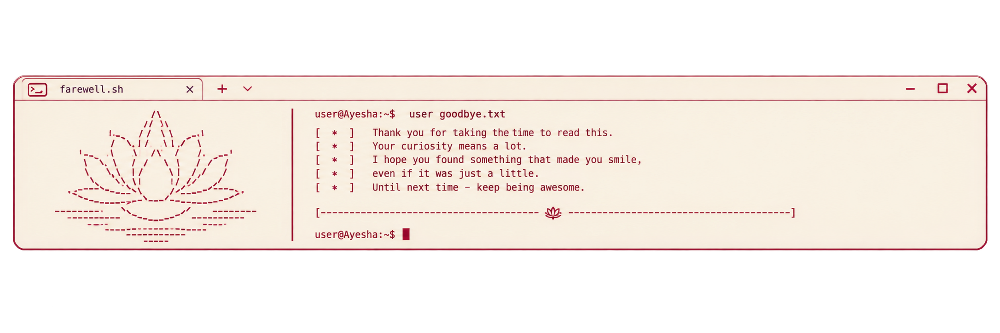

<p align="center">
  
</p>

<div align="center">

<sub>ISSUE 01  ·  STUDIO ARCHIVE  ·  2026</sub>

<h1 align="center">
  <a href="https://git.io/typing-svg">
    
  </a>
</h1>
</div>

# AYESHA NAYAAB NADEEM

<div align="right">

<sub>NO. 00  ·  INTRODUCTION  ·  ME </sub>

</div>

<p align="center">
  
</p>

> **I build software with an eye for detail.**
>
> Systems should work beautifully. Interfaces should feel inevitable.
> Good design should disappear into the experience.

I'm a **software engineer and creative designer** interested in the space where technology meets visual culture. I like complicated things. Not because they should stay complicated—but because there is something satisfying about taking them apart, finding the structure underneath, and rebuilding them into something **clear, useful, expressive and quietly beautiful.** My work sits somewhere between:

<p align="center">
  
  
  
  
</p>

I care about architecture, interaction, typography, accessibility, visual systems, and the tiny details most people never notice. And yes, I have absolutely spent too long fixing a 2px alignment.

<br>

---


<pre>
             ·············
         ··························
     ··························· ············                                                                                                                       ········
 ······ ····························· ··                                                                                                                      · · ··········
···············································                                                                                                         ··· ·· ·· ··········
········           ·····························                                                                                                 ············· ·· ··········
··                  ································                                                                               ························ · ··· · ··········
··                   ···············     ···············                                                                 ·····················    ··   ···· ·· ·· ··········
·                     ··············                   ·····                                           ··································  ···        ··· · ·· ·· ··········
                    ·· ··············                     ····                                   ····································      ·       ·  ··· ···· ·· ··········
                ·      ····  · ········    ·                 ···                             ·······  ·············     ············                         ··          ···
              ·         ···     ········                                                   ···               ··· ··   ·············
            ·             ··················                                                  ···         ·  ·       ······   ··
          ·                    ··············                    ·· ·                                              ······
        ·                           ······· ·                     ···                                         ·······                       ··                       · ·····
      ·                               ·····     ·                                                           ·····       ··                ··                               ·
   ·                                          ··  ·                                                       ······         ····  ···     ···
·                                               ··                                                      ··        ··                ····
                                                                                                         ·····   ·    ·       ·······
                                                                                                           ··    ·   ·       ·
                                                                                                           ·    ·   ·       ·
                                                                                                           ···  ·   ·   ··  ·
                                                                                                           ···  ·· ··   ·· ·
                                                                                                            ·  · ····   ···
</pre>

<br>

# PROFILE

<div align="right">

<sub>NO. 01  ·  ABOUT ME  ·  PERSONNEL </sub>

# 𝓪 𝓵𝓲𝓽𝓽𝓵𝓮 𝓪𝓫𝓸𝓾𝓽 𝓶𝓮

</div>

<br>

<pre>
    __________
 / ___  ___ \
/ / @ \/ @ \ \
\ \___/\___/ /\
 \____\/____/||  
 /     /\\\\\//
 |     |\\\\\\
  \      \\\\\\
   \______/\\\\
    _||_||_
     -- --
</pre>

```javascript

const interests = {
  writes: ["poetry", "fiction", "essays", "journals"],
  creates: ["paint", "illustration", "mixed media"],
  fascinatedBy: ["astronomy", "medieval architecture", "renaissance art", "philosophy"],
  enjoys: ["chess", "horse riding", "archery", "old letters"],
  deciphers: ["BSL", "Morse", "A1Z26", "shorthand"],
  funFact: "I am an ambidextrous"
}

```

<br>

# THE PRACTICE

<div align="right">

<sub>NO. 02  ·  CAPABILITIES  ·  THE WORKBENCH</sub>

</div>

### 01 / Digital Practice

*The tools that shape the way I build, design, test and ship.*

<p align="left">


</p>

### 02 / Languages of Construction

*The languages I use to turn ideas into interfaces, systems and functioning things.*

<p align="left">


</p>

### 03 / Systems & Tools

*The software around the software—the things I use to think, organise, design, document and collaborate.*

<p align="left">


</p>

<br>

I move naturally between technical and creative work.

One day that means designing a component system.
Another, writing an API.
Another, thinking about typefaces, medieval architecture, astronomy, or why an old handwritten letter somehow feels more alive than most modern interfaces.

I like **precision with personality**.

<p align="center">
  
</p>

<br>

# STUDIO NOTES

<div align="right">

<sub>NO. 04  ·  OBSERVATIONS  ·  CURRENT THINKING</sub>

</div>

<br>

### On making things

I believe good software is not merely functional.

It has rhythm.

It has hierarchy.
It has restraint.
It has moments of surprise.

Engineering gives an idea **structure**.

Design gives it **character**.

The interesting work happens somewhere between the two.

<br>

### Currently

```text
BUILDING     →  software, interfaces, systems
LEARNING     →  better architecture & better questions
EXPLORING    →  creative technology
READING      →  philosophy, art, old things
THINKING     →  how digital spaces can feel more human
```

<br>

# CORRESPONDENCE

<div align="right">

<sub>NO. 06  ·  CONTACT  ·  OPEN CHANNEL</sub>

</div>

<br>

*For opportunities, collaborations, curious conversations, or simply saying hello.*

<br>

<p align="center">

<a href="https://github.com/[USERNAME]">

</a>

<a href="https://www.linkedin.com/in/[HANDLE]">

</a>

<a href="https://[YOUR-SITE]">

</a>

<a href="mailto:[YOU@EXAMPLE.COM]">

</a>

</p>

<p align="center">
  
</p>

<details>
<summary><sub>PLAIN TEXT VERSION</sub></summary>

<br>

**Ayesha Nayaab Nadeem — Software Engineer & Creative Designer**

Issue 01 · Studio Archive · 2026

I build software with an eye for detail. My work sits between engineering, design, systems and visual storytelling.

I enjoy taking complicated things apart, finding the essential structure, and rebuilding them into experiences that feel clear, useful and considered.

**Practice**

Languages: Java, Python, JavaScript, HTML, CSS, SQL.

Technologies & tools: React, TypeScript, Flask, Docker, Git, GitHub, Storybook, Jest, Styled Components, Notion, VS Code.

**Interests**

Writing, painting, illustration, mixed media, astronomy, medieval architecture, Renaissance art, philosophy, chess, horse riding, archery, old letters and historical systems of writing.

**Currently**

Building software and interfaces. Learning better architecture. Exploring creative technology. Thinking about how digital spaces can feel more human.

**Contact**

GitHub · LinkedIn · Portfolio · Email

A.Y. / Digital Craft · 2026

</details>
